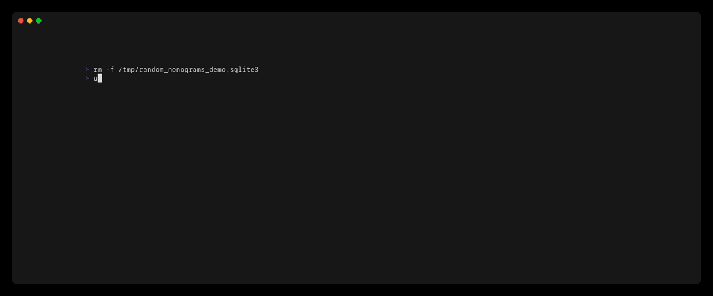

nonogram solver in python based on CPMpy (OR-tools under the hood)

# Basic usage

This project uses [uv](https://docs.astral.sh/uv/). No setup is
necessary once you have uv, just invoke `uv run` and you're off to go.

Find a puzzle on [Web Paint-By-Number](https://webpbn.com/). Grab the
ID of the puzzle from the puzzle page or off the end of the URL.

Run `get_nonogram` to fetch a copy of the puzzle to your local disk,
where the number at the end is the ID of the puzzle you grabbed in the
previous step:

```python
uv run get_nonogram 2
```

This will create an XML file in the `puzzles` directory.

Run `solve_nonogram` to solve a downloaded puzzle XML:


If a nonogram does not have a unique solution, you'll get one of the
solutions at random for illustration and, if a solution was provided
to check against, whether any of the found solutions matches the given
solution:


# Other tools

Run `benchmark_nonogram` to solve every supported puzzle in the
`puzzles/` directory and report the runtime. Output options include
rich and csv:


Run `solve_random_nonograms` to generate random nonograms, solve them,
and tally up the resulting statistics. Nonograms are generated by
randomly filling each cell with probability `p` between `p_min` and
`p_max`; for example, `p=0.1` means that 10% of the cells are
filled. The live heatmap uses numbers to count the trials run for each
set of parameters and color to show the measured probability of a
random nonogram with those parameters having a unique solution.



The solutions will be stored in a sqlite3 database if you want to
collect a *bunch* of statistics over, say, a period of days or weeks.
you can pick up where you left off by just reissuing the same command
or by using `continue_random_nonograms`, which will use the data in
the db to estimate the original set of parameters.


# Current limitations

Can only handle monochrome (black-and-white) puzzles, no color support
yet.

Blotted clues, which indicate the presence of a block of filled cells
of unspecified length, are not supported.

Can only accept puzzles in the [webpbn XML format](https://webpbn.com/pbn_fmt.html).

# Acknowledgments

Thanks to webpbn and its users for providing the problem instances in
the `puzzles/` directory. Having a set of instances whose designers
have given permission for redistribution makes this project a lot
easier.
